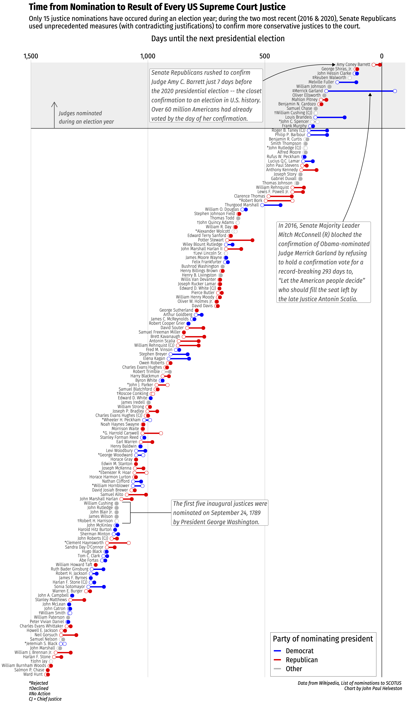

<!-- README.md is generated from README.Rmd. Please edit that file -->

```{r, include = FALSE}
knitr::opts_chunk$set(
  collapse = TRUE,
  warning = FALSE,
  message = FALSE,
  fig.retina = 3
)
library(fontawesome)
```

# charts

A repo of reproducible charts.

To reproduce any of these charts, follow these steps:

1. Fork or download all of the files in this repository.
2. If you haven't already, [install R](https://cloud.r-project.org/) and [install RStudio](https://www.rstudio.com/products/rstudio/download/preview/) on your computer.
3. Open the "charts.Rproj" file, which will open RStudio and set the working directory to the local folder on your computer containing the files in this repository.
4. Open and run the "makePlots.R" file in any of the folders to produce the plots, which will be saved in the corresponding "plots" folder.

**Note**: Most of these plots require additional libraries - read the top of each "makePlots.R" file to see which ones you should install.

# List of charts
- [challengerOrings](#challengerOrings)
- [climateChangeBarcode](#climateChangeBarcode)
- [electionMargins](#electionMargins)
- [electricityEIA](#electricityEIA)
- [ggxaringan](#ggxaringan)
- [lcetPatenting](#lcetPatenting)
- [newEnergyInvestment](#newEnergyInvestment)
- [scienceCommentary2019](#scienceCommentary2019)
- [scotusNominations](#scotusNominations)
- [solarPvProduction](#solarPvProduction)
- [usHighwayFund](#usHighwayFund)
- [usSolarIndustry](#usSolarIndustry)
- [worldNuclearAssociation](#worldNuclearAssociation)

## challengerOrings

**Description**: Scatterplot of rocket o-ring damage vs. launch temperature for test launches prior to Jan. 28, 1986 Challenger launch. Original figure in [Tufte E.R. 1997. Visual Explanations. Graphics Press](https://pubs.acs.org/doi/abs/10.1021/ci9804286). Cheshire, Connecticut, U.S.A.

**Data**: Presidential Commission on the Space Shuttle Challenger Accident, Vol. 1, 1986: 129-131.

```{r echo = FALSE, out.width = "90%", fig.link="https://github.com/jhelvy/charts/tree/master/challengerOrings", fig.cap="Scatterplot of rocket o-ring damage vs. launch temperature"}
knitr::include_graphics("challengerOrings/plots/challengerOrings.png")
```

## climateChangeBarcode

**Description**: "Barcode" plots showing the long term rise in global and US temperatures. Each vertical stripe represents the average temperature of a single year, ordered from the earliest available data to the present. Original figures by [Ed Hawkins](http://www.climate-lab-book.ac.uk/2018/warming-stripes/)

**Data**: 1) [NASA (2018) "Goddard Institute for Space Studies (GISS)"](https://climate.nasa.gov/vital-signs/global-temperature/); 2) [NOAA National Centers for Environmental information](http://www.ncdc.noaa.gov/cag/).

```{r echo = FALSE, out.width = "75%", fig.link="https://github.com/jhelvy/charts/tree/master/climateChangeBarcode", fig.cap="Global temperatures, 1880 - 2018, NASA"}
knitr::include_graphics("climateChangeBarcode/plots/nasa_global_preview.png")
```

## electionMargins

**Description**: Bar plots of the popular vote margin by elected U.S. Presidents from 1824 to present.

**Data**: [Encyclopaedia Britannica, United States Presidential Election Results](https://www.britannica.com/topic/United-States-Presidential-Election-Results-1788863)

```{r echo = FALSE, out.width = "60%", fig.link="https://github.com/jhelvy/charts/tree/master/electionMargins", fig.cap="Bar plots of the popular vote margin by elected U.S. Presidents"}
knitr::include_graphics("electionMargins/plots/election_margins_pop.png")
```

## electricityEIA

**Description**: Barplots of energy capacity and generation by country / region using EIA data.

**Data**: [U.S. Energy Information Administration (EIA)](https://www.eia.gov/beta/international/data/browser/)

```{r echo = FALSE, out.width = "75%", fig.link="https://github.com/jhelvy/charts/tree/master/electricityEIA", fig.cap="Installed Wind and Nuclear Power Capacity by Country / Region, 2000 - 2016"}
knitr::include_graphics("electricityEIA/plots/windNuclearCapacityCompare.png")
```

## ggxaringan

This folder contains the files used to create [this short screen recording](https://youtu.be/c436_dfk9-E) demonstrating how I use the `inf_mr()` function from the [**xaringan** package](https://github.com/yihui/xaringan) to interactively create and customize a plot in R using ggplot2.

Watch the video here:

<a href="http://www.youtube.com/watch?v=l9yUGFelT5c" target="_blank">
    
</a>

## lcetPatenting

**Description**: Patenting in clean energy technologies by country and over time.

**Data**: [2018 U.S. NSF Science & Engineering Indicators](https://www.nsf.gov/statistics/2018/nsb20181/report/sections/industry-technology-and-the-global-marketplace/global-trends-in-sustainable-energy-research-and-technologies)

```{r echo = FALSE, out.width = "60%", fig.link="https://github.com/jhelvy/charts/tree/master/lcetPatenting", fig.cap="Annual USPTO Patents in Clean Energy Technologies, 2006 - 2016"}
knitr::include_graphics("lcetPatenting/plots/patentPlot.png")
```

## newEnergyInvestment

**Description**: Plots of new clean energy investment by country and type.

**Data**: Clean energy investment by [Bloomberg New Energy Finance](https://about.bnef.com/clean-energy-investment/)

```{r echo = FALSE, out.width = "60%", fig.link="https://github.com/jhelvy/charts/tree/master/newEnergyInvestment", fig.cap="New Investment in Clean Energy ($USD Billion), 2005 - 2018"}
knitr::include_graphics("newEnergyInvestment/plots/countryLines.png")
```

## scienceCommentary2019

**Description**: The chart in our [2019 Science Policy Forum article](https://science.sciencemag.org/content/366/6467/794) - investment and patenting in clean energy technologies by country and over time.

**Data**: Clean energy investment by [Bloomberg New Energy Finance](https://about.bnef.com/clean-energy-investment/); Patenting by [2018 U.S. NSF Science & Engineering Indicators](https://www.nsf.gov/statistics/2018/nsb20181/report/sections/industry-technology-and-the-global-marketplace/global-trends-in-sustainable-energy-research-and-technologies)

```{r echo = FALSE, out.width = "60%", fig.link="https://github.com/jhelvy/charts/tree/master/scienceCommentary2019", fig.cap="Investment and patenting in clean energy technologies by country and over time"}
knitr::include_graphics("scienceCommentary2019/plots/figure1.png")
```

## scotusNominations

**Description**: Time from Nomination to Result of Every US Supreme Court Justice.

**Data**: [Wikipedia](https://en.wikipedia.org/wiki/List_of_nominations_to_the_Supreme_Court_of_the_United_States) [The Green Papers](https://www.thegreenpapers.com/Hx/PresidentialElectionEvents.phtml)

```{r echo = FALSE, out.width = "65%", fig.link="https://github.com/jhelvy/charts/tree/master/scotusNominations", fig.cap="Time from Nomination to Result of Every US Supreme Court Justice"}

```

## solarPvProduction

**Description**: Bar plot of global annual solar photovoltaic cell production by country.

**Data**: 1995 to 2013: [Earth Policy Institute](http://www.earth-policy.org/data_center/C23); 2014 to 2018: [Jäger-Waldau, A. (2019). Snapshot of Photovoltaics—February 2019. Energies, 12(5), 769](https://www.mdpi.com/1996-1073/12/5/769). Data reverse engineered from Figure 1 using [WebPlotDigitizer](https://automeris.io/WebPlotDigitizer/).

```{r echo = FALSE, out.width = "60%", fig.link="https://github.com/jhelvy/charts/tree/master/solarPvProduction", fig.cap="Annual Solar Voltaic Cell Production (GW), 2000 - 2018"}
knitr::include_graphics("solarPvProduction/plots/solarBars.png")
```

## usHighwayFund

**Description**: The chart in my 2017 article: ["Perspective: Navigating an Uncertain Future for US Roads,” Issues in Science and Technology 34, no. 1 (Fall 2017)"](http://issues.org/34-1/perspective-navigating-an-uncertain-future-for-us-roads/). The chart shows federal highway fund revenues and expenditures in real dollars from 1980 to 2015.

**Data**: [Status of the Highway Trust Fund, Fiscal Years 1957-2015](https://www.fhwa.dot.gov/policyinformation/statistics/2015/fe210.cfm)

```{r echo = FALSE, out.width = "60%", fig.link="https://github.com/jhelvy/charts/tree/master/usHighwayFund", fig.cap="Federal highway fund revenues and expenditures in real dollars, 1980 - 2015"}
knitr::include_graphics("usHighwayFund/plots/usHighwayFund2015.png")
```

## usSolarIndustry

**Description**: Summary plots of the US solar industry, including total module deployment and job growth pre- and post- the 2018 Trump administration tariffs.

**Data**: Jobs data from [Solar Foundation](https://www.bloomberg.com/news/articles/2019-02-12/trump-s-tariffs-took-a-bite-out-of-once-booming-solar-job-market); modules data from [US EIA](https://www.eia.gov/renewable/monthly/solar_photo/)

```{r echo = FALSE, out.width = "60%", fig.link="https://github.com/jhelvy/charts/tree/master/usSolarIndustry", fig.cap="U.S. Solar Photovoltaic Module Shipments, 2006 - 2018"}
knitr::include_graphics("usSolarIndustry/plots/moduleShipments.png")
```

## worldNuclearAssociation

**Description**: Barplots of nuclear energy capacity by country.

**Data**: Webscraped data from the [World Nuclear Association](http://www.world-nuclear.org/information-library/facts-and-figures/world-nuclear-power-reactors-and-uranium-requireme.aspx)

```{r echo = FALSE, out.width = "60%", fig.link="https://github.com/jhelvy/charts/tree/master/worldNuclearAssociation", fig.cap="New Nuclear Energy Capacity (GW) by Country, 2008 - 2019"}
knitr::include_graphics("worldNuclearAssociation/plots/newCapacity.png")
```

# License `r fa("creative-commons")``r fa("creative-commons-by")``r fa("creative-commons-sa")`

All charts are released under a [Creative Commons Attribution-ShareAlike 4.0 International License](https://creativecommons.org/licenses/by-sa/4.0/).
