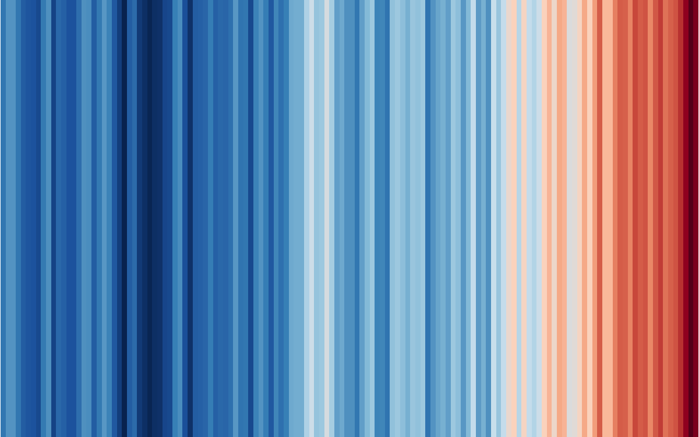
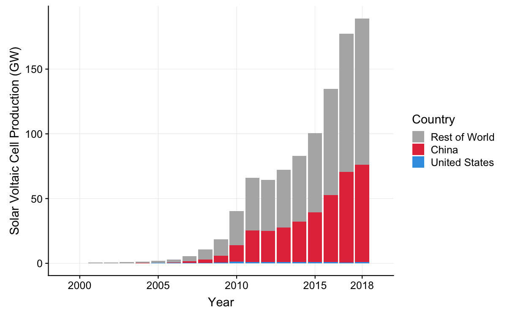
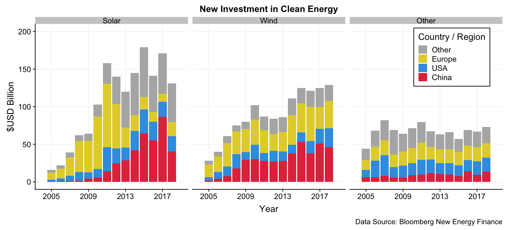
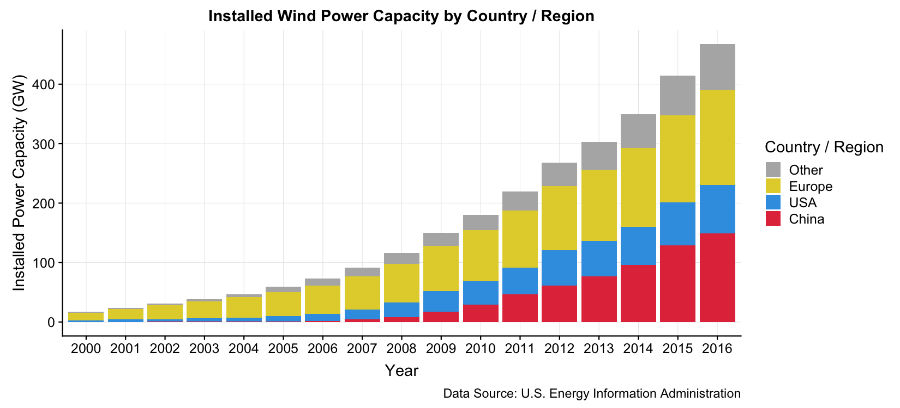

charts
================

A repo of reproducible charts

# Table of Contents

  - [climateChangeBarcode](#climateChangeBarcode)
  - [solarPvProduction](#solarPvProduction)
  - [newEnergyInvestment](#newEnergyInvestment)
  - [electricityEIA](#electricityEIA)

## climateChangeBarcode

“Barcode” plots showing the long term rise in global and US
temperatures. Each vertical stripe represents the average temperature of
a single year, ordered from the earliest available data to the present.
Original figures by [Ed
Hawkins](http://www.climate-lab-book.ac.uk/2018/warming-stripes/#more-5516).

*Global temperatures, 1880 - 2018,
NASA*

## solarPvProduction

Barplot of global annual solar photovoltaic cell production by country.

*Annual Solar Voltaic Cell Production (GW), 2000 -
2018*

## newEnergyInvestment

Barplots of new clean energy investment by country and type.

*New Investment in Clean Energy ($USD Billion), 2005 -
2018*

## electricityEIA

Barplots of energy capacity and generation by country / region using EIA
data.

*Installed Wind Power Capacity by Country / Region, 2000 -
2016*

# Author and License

  - Author: John Paul Helveston (www.jhelvy.com)
  - License: GPL-3
