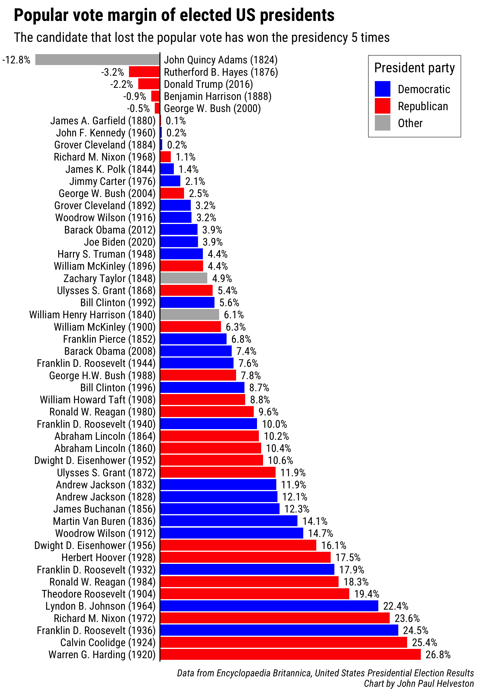
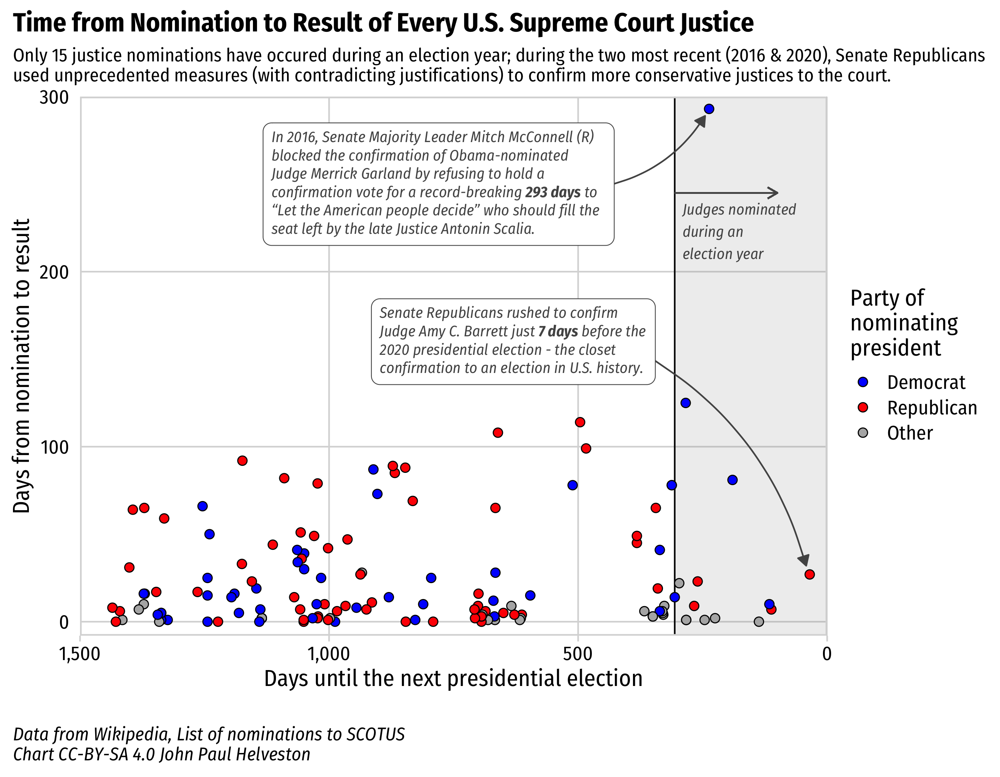
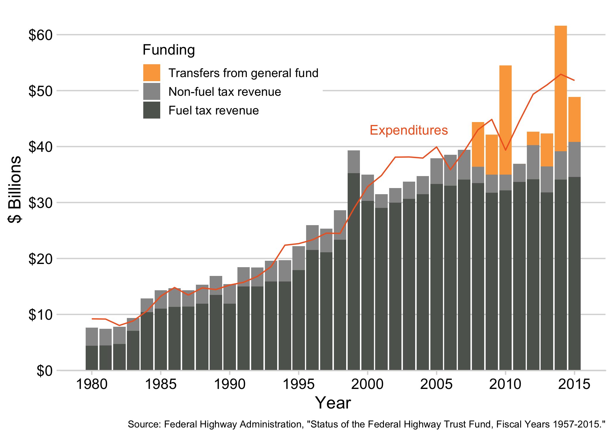
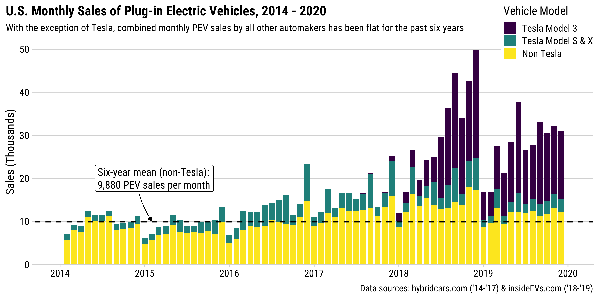

<!-- README.md is generated from README.Rmd. Please edit that file -->

A repo of reproducible charts, by [**John Paul
Helveston**](https://www.jhelvy.com/)

This work is licensed under a [Creative Commons
Attribution-NonCommercial-ShareAlike 4.0 International
License](http://creativecommons.org/licenses/by-nc-sa/4.0/)

# List of charts

  - [challengerOrings](#challengerOrings)
  - [climateChangeBarcode](#climateChangeBarcode)
  - [electionMargins](#electionMargins)
  - [electricityEIA](#electricityEIA)
  - [ggxaringan](#ggxaringan)
  - [lcetPatenting](#lcetPatenting)
  - [newEnergyInvestment](#newEnergyInvestment)
  - [scienceCommentary2019](#scienceCommentary2019)
  - [scotusNominations](#scotusNominations)
  - [solarPvProduction](#solarPvProduction)
  - [usHighwayFund](#usHighwayFund)
  - [usPevSales](#usPevSales)
  - [usSolarIndustry](#usSolarIndustry)
  - [worldNuclearAssociation](#worldNuclearAssociation)

# challengerOrings

**Description**: Scatterplot of rocket o-ring damage vs. launch
temperature for test launches prior to Jan. 28, 1986 Challenger launch.
Original figure in [Tufte E.R. 1997. Visual Explanations. Graphics
Press](https://pubs.acs.org/doi/abs/10.1021/ci9804286). Cheshire,
Connecticut, U.S.A.

**Data**: Presidential Commission on the Space Shuttle Challenger
Accident, Vol. 1, 1986: 129-131.

Scatterplot of rocket o-ring damage vs. launch temperature

# climateChangeBarcode

**Description**: “Barcode” plots showing the long term rise in global
and US temperatures. Each vertical stripe represents the average
temperature of a single year, ordered from the earliest available data
to the present. Original figures by [Ed
Hawkins](http://www.climate-lab-book.ac.uk/2018/warming-stripes/)

**Data**: 1) [NASA (2018) “Goddard Institute for Space Studies
(GISS)”](https://climate.nasa.gov/vital-signs/global-temperature/); 2)
[NOAA National Centers for Environmental
information](http://www.ncdc.noaa.gov/cag/).

Global temperatures, 1880 - 2018, NASA

# electionMargins

**Description**: Bar plots of the popular vote margin by elected U.S.
Presidents from 1824 to present.

**Data**: [Encyclopaedia Britannica, United States Presidential Election
Results](https://www.britannica.com/topic/United-States-Presidential-Election-Results-1788863)

Bar plots of the popular vote margin by elected U.S. Presidents

# electricityEIA

**Description**: Barplots of energy capacity and generation by country /
region using EIA data.

**Data**: [U.S. Energy Information Administration
(EIA)](https://www.eia.gov/beta/international/data/browser/)

Installed Wind and Nuclear Power Capacity by Country / Region, 2000 -
2016

# ggxaringan

This folder contains the files used to create [this short screen
recording](https://youtu.be/c436_dfk9-E) demonstrating how I use the
`inf_mr()` function from the [**xaringan**
package](https://github.com/yihui/xaringan) to interactively create and
customize a plot in R using ggplot2.

Watch the video here:

# lcetPatenting

**Description**: Patenting in clean energy technologies by country and
over time.

**Data**: [2018 U.S. NSF Science & Engineering
Indicators](https://www.nsf.gov/statistics/2018/nsb20181/report/sections/industry-technology-and-the-global-marketplace/global-trends-in-sustainable-energy-research-and-technologies)

Annual USPTO Patents in Clean Energy Technologies, 2006 - 2016

# newEnergyInvestment

**Description**: Plots of new clean energy investment by country and
type.

**Data**: Clean energy investment by [Bloomberg New Energy
Finance](https://about.bnef.com/clean-energy-investment/)

New Investment in Clean Energy ($USD Billion), 2005 - 2018

# scienceCommentary2019

**Description**: The chart in our [2019 Science Policy Forum
article](https://science.sciencemag.org/content/366/6467/794) -
investment and patenting in clean energy technologies by country and
over time.

**Data**: Clean energy investment by [Bloomberg New Energy
Finance](https://about.bnef.com/clean-energy-investment/); Patenting by
[2018 U.S. NSF Science & Engineering
Indicators](https://www.nsf.gov/statistics/2018/nsb20181/report/sections/industry-technology-and-the-global-marketplace/global-trends-in-sustainable-energy-research-and-technologies)

Investment and patenting in clean energy technologies by country and
over time

# scotusNominations

**Description**: Time from Nomination to Result of Every US Supreme
Court Justice.

**Data**:
[Wikipedia](https://en.wikipedia.org/wiki/List_of_nominations_to_the_Supreme_Court_of_the_United_States)
[The Green
Papers](https://www.thegreenpapers.com/Hx/PresidentialElectionEvents.phtml)

Time from Nomination to Result of Every US Supreme Court Justice

# solarPvProduction

**Description**: Bar plot of global annual solar photovoltaic cell
production by country.

**Data**: 1995 to 2013: [Earth Policy
Institute](http://www.earth-policy.org/data_center/C23); 2014 to 2018:
[Jäger-Waldau, A. (2019). Snapshot of Photovoltaics—February 2019.
Energies, 12(5), 769](https://www.mdpi.com/1996-1073/12/5/769). Data
reverse engineered from Figure 1 using
[WebPlotDigitizer](https://automeris.io/WebPlotDigitizer/).

Annual Solar Voltaic Cell Production (GW), 2000 - 2018

# usHighwayFund

**Description**: The chart in my 2017 article: [“Perspective: Navigating
an Uncertain Future for US Roads,” Issues in Science and Technology 34,
no. 1 (Fall
2017)"](http://issues.org/34-1/perspective-navigating-an-uncertain-future-for-us-roads/).
The chart shows federal highway fund revenues and expenditures in real
dollars from 1980 to 2015.

**Data**: [Status of the Highway Trust Fund, Fiscal
Years 1957-2015](https://www.fhwa.dot.gov/policyinformation/statistics/2015/fe210.cfm)

Federal highway fund revenues and expenditures in real dollars, 1980 -
2015

# usPevSales

**Description**: The chart in my 2021 article in *Issues in Science and
Technology* titled, [“Why the US Trails the World in Electric
Vehicles”](https://issues.org/china-norway-ev-tesla/). The chart shows
monthly sales of plug-in electric vehicles in the US from 2014 to 2020.

**Data**: [hybridcars.com
(’14-’17)](https://www.hybridcars.com/june-2018-hybrid-cars-sales-dashboard/)
and [insideEVs.com
(’18-’19)](https://insideevs.com/news/343998/monthly-plug-in-ev-sales-scorecard/)

U.S. Monthly Sales of Plug-in Electric Vehicles, 2014 - 2020

# usSolarIndustry

**Description**: Summary plots of the US solar industry, including total
module deployment and job growth pre- and post- the 2018 Trump
administration tariffs.

**Data**: Jobs data from [Solar
Foundation](https://www.bloomberg.com/news/articles/2019-02-12/trump-s-tariffs-took-a-bite-out-of-once-booming-solar-job-market);
modules data from [US
EIA](https://www.eia.gov/renewable/monthly/solar_photo/)

U.S. Solar Photovoltaic Module Shipments, 2006 - 2018

# worldNuclearAssociation

**Description**: Barplots of nuclear energy capacity by country.

**Data**: Webscraped data from the [World Nuclear
Association](http://www.world-nuclear.org/information-library/facts-and-figures/world-nuclear-power-reactors-and-uranium-requireme.aspx)

New Nuclear Energy Capacity (GW) by Country, 2008 - 2019

