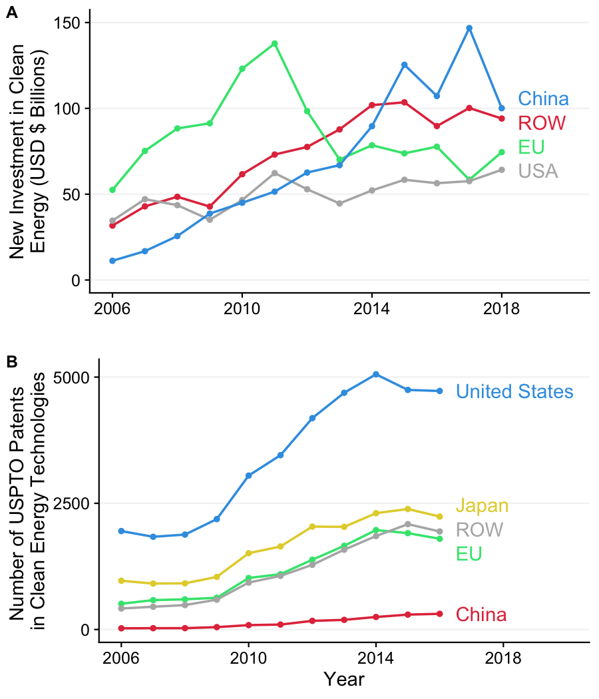

charts
================

A repo of reproducible charts.

To reproduce any of these charts, follow these steps:

1. Fork or download all of the files in this repository.
2. If you haven't already, (install R)[https://cloud.r-project.org/] and (install RStudio)[https://www.rstudio.com/products/rstudio/download/preview/] on your computer.
3. Open the "charts.Rproj" file, which will open RStudio and set the working directory to the local folder on your computer containing the files in this repository.
4. Open and run the "makePlots.R" file in any of the folders to produce the plots, which will be saved in the corresponding "plots folder".

| Description | Example Plot |
| :----------- | :------------: |
| **climateChangeBarcode**:  "Barcode" plots showing the long term rise in global and US temperatures. Each vertical stripe represents the average temperature of a single year, ordered from the earliest available data to the present. Original figures by [Ed Hawkins](http://www.climate-lab-book.ac.uk/2018/warming-stripes/\#more-5516).  Data: 1) [NASA (2018) "Goddard Institute for Space Studies (GISS)"](https://climate.nasa.gov/vital-signs/global-temperature/); 2) [NOAA National Centers for Environmental information](http://www.ncdc.noaa.gov/cag/). | *Global temperatures, 1880 - 2018, NASA*  |
| **electricityEIA**:  Barplots of energy capacity and generation by country / region using EIA data.  Data: [U.S. Energy Information Administration (EIA)](https://www.eia.gov/beta/international/data/browser/) | *Installed Wind and Nuclear Power Capacity by Country / Region, 2000 - 2016.*  |
| **lcetPatenting**:  Plots of patenting in clean energy technologies by country and over time.  Data: (2018 U.S. NSF Science & Engineering Indicators)[https://www.nsf.gov/statistics/2018/nsb20181/report/sections/industry-technology-and-the-global-marketplace/global-trends-in-sustainable-energy-research-and-technologies] | *Annual USPTO Patents in Clean Energy Technologies, 2006 - 2016*  |
| **newEnergyInvestment**:  Plots of new clean energy investment by country and type.  Data: Clean energy investment by [Bloomberg New Energy Finance](https://about.bnef.com/clean-energy-investment/) | *New Investment in Clean Energy ($USD Billion), 2005 - 2018*  |
| **scienceCommentary2019**:  Plots of investment and patenting in clean energy technologies by country and over time.  Data: Clean energy investment by [Bloomberg New Energy Finance](https://about.bnef.com/clean-energy-investment/); Patenting by (2018 U.S. NSF Science & Engineering Indicators)[https://www.nsf.gov/statistics/2018/nsb20181/report/sections/industry-technology-and-the-global-marketplace/global-trends-in-sustainable-energy-research-and-technologies] |  |
| **solarPvProduction**:  Barplot of global annual solar photovoltaic cell production by country.  Data: 1995 to 2013: [Earth Policy Institute](http://www.earth-policy.org/data_center/C23); 2014 to 2018: [Jäger-Waldau, A. (2019). Snapshot of Photovoltaics—February 2019. Energies, 12(5), 769](https://www.mdpi.com/1996-1073/12/5/769). Data reverse engineered from Figure 1 using [WebPlotDigitizer](https://automeris.io/WebPlotDigitizer/). | *Annual Solar Voltaic Cell Production (GW), 2000 - 2018*  |
| **usSolarIndustry**:  Summary plots of the US solar industry, including total module deployment and job growth pre and post the Trump administration tariffs.  Data: Jobs data from (Solar Foundation)[https://www.bloomberg.com/news/articles/2019-02-12/trump-s-tariffs-took-a-bite-out-of-once-booming-solar-job-market]; modules data from (US EIA)[https://www.eia.gov/renewable/monthly/solar_photo/] | *U.S. Solar Photovoltaic Module Shipments, 2006 - 2018*  |
| **worldNuclearAssociation**:  Barplots of nuclear energy capacity by country.  Data: Webscraped data from the [World Nuclear Association](http://www.world-nuclear.org/information-library/facts-and-figures/world-nuclear-power-reactors-and-uranium-requireme.aspx) | *New Nuclear Energy Capacity (GW) by Country, 2008 - 2019*  |

# Author and License
* Author: John Paul Helveston (www.jhelvy.com)
* License: GPL-3
