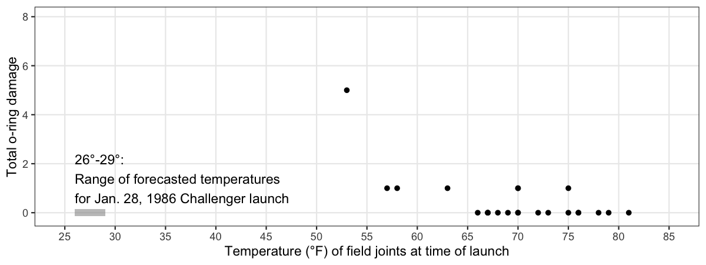
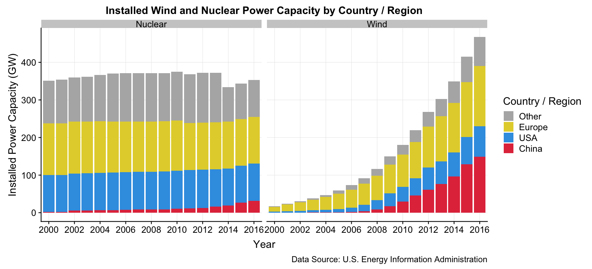
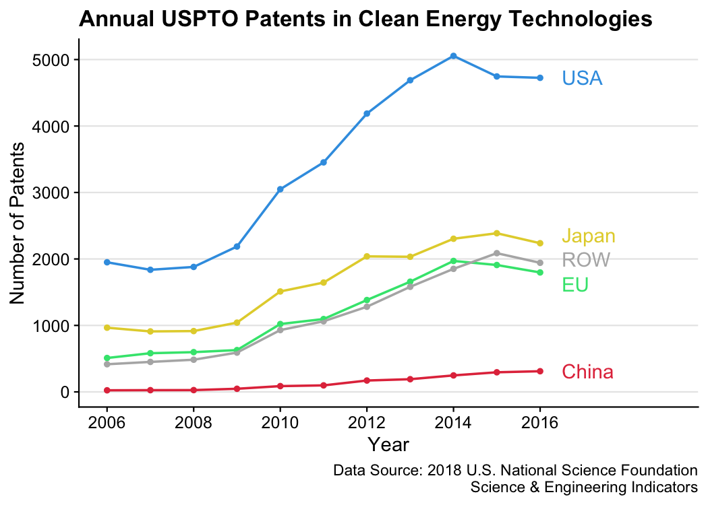
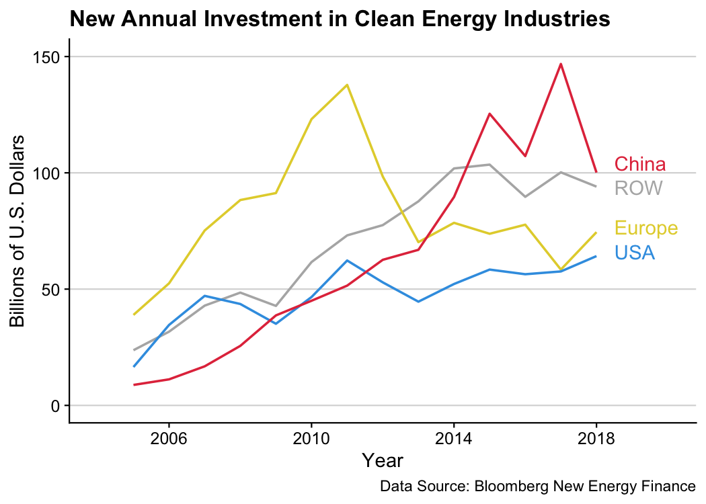
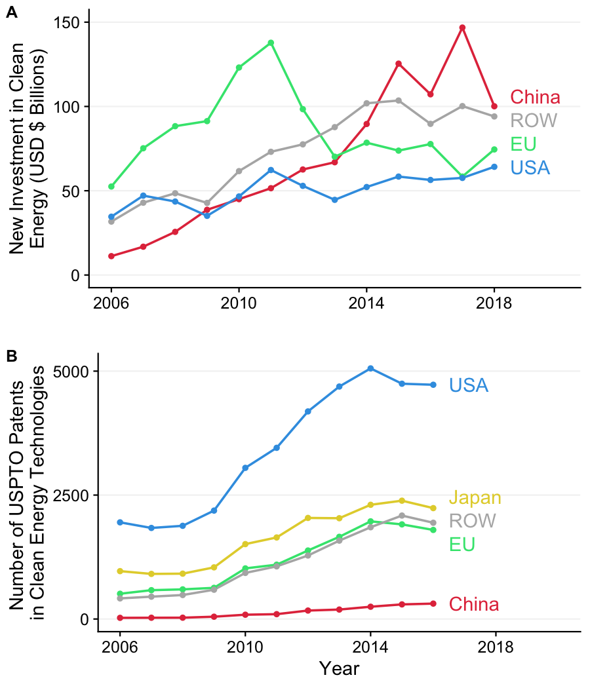
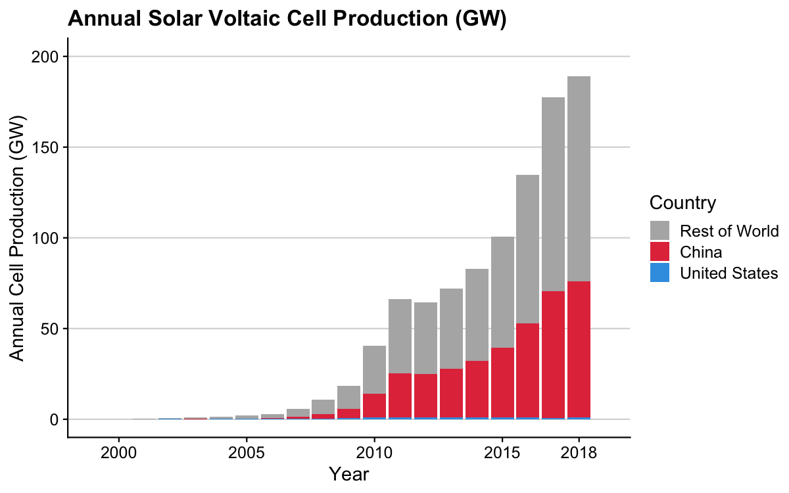
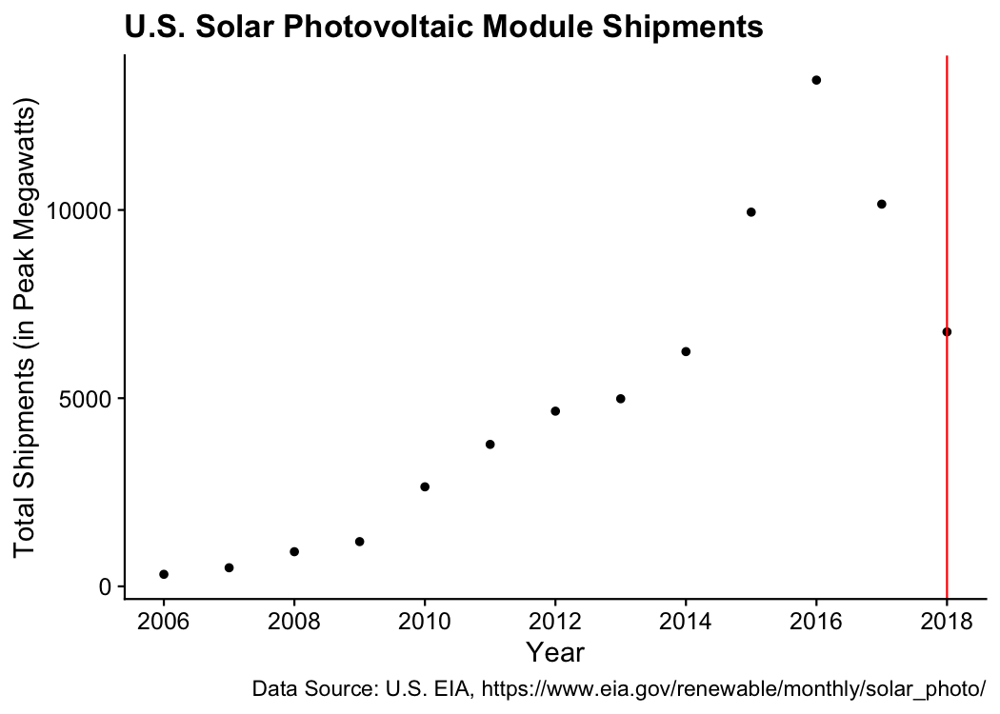
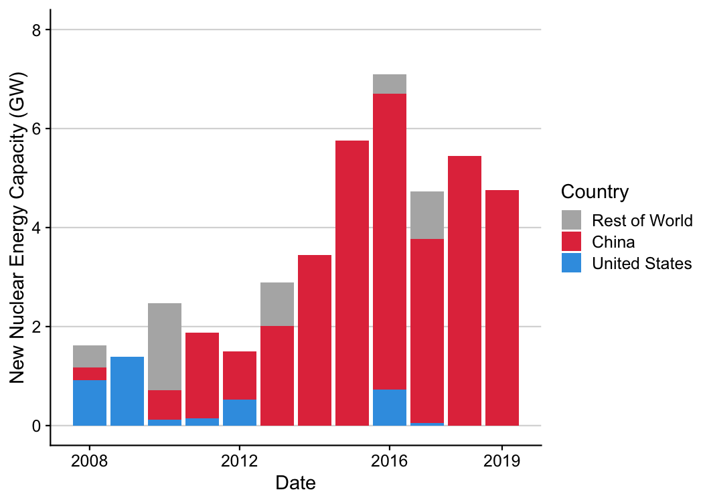

charts
================

A repo of reproducible charts.

To reproduce any of these charts, follow these steps:

1. Fork or download all of the files in this repository.
2. If you haven't already, [install R](https://cloud.r-project.org/) and [install RStudio](https://www.rstudio.com/products/rstudio/download/preview/) on your computer.
3. Open the "charts.Rproj" file, which will open RStudio and set the working directory to the local folder on your computer containing the files in this repository.
4. Open and run the "makePlots.R" file in any of the folders to produce the plots, which will be saved in the corresponding "plots" folder.

**Note**: Most of these plots require additional libraries - read the top of each "makePlots.R" file to see which ones you should install.

# List of charts
- [challengerOrings](#challengerOrings)
- [climateChangeBarcode](#climateChangeBarcode)
- [electricityEIA](#electricityEIA)
- [ggxaringan](#ggxaringan)
- [lcetPatenting](#lcetPatenting)
- [newEnergyInvestment](#newEnergyInvestment)
- [scienceCommentary2019](#scienceCommentary2019)
- [solarPvProduction](#solarPvProduction)
- [usSolarIndustry](#usSolarIndustry)
- [worldNuclearAssociation](#worldNuclearAssociation)

## challengerOrings

**Description**: Scatterplot of rocket o-ring damage vs. launch temperature for test launches prior to Jan. 28, 1986 Challenger launch. Original figure in [Tufte](https://www.edwardtufte.com/), E.R. 1997. Visual Explanations. Graphics Press, Cheshire, Connecticut, U.S.A.

**Data**: Presidential Commission on the Space Shuttle Challenger Accident, Vol. 1, 1986: 129-131.

## climateChangeBarcode

**Description**: "Barcode" plots showing the long term rise in global and US temperatures. Each vertical stripe represents the average temperature of a single year, ordered from the earliest available data to the present. Original figures by [Ed Hawkins](http://www.climate-lab-book.ac.uk/2018/warming-stripes/)

**Data**: 1) [NASA (2018) "Goddard Institute for Space Studies (GISS)"](https://climate.nasa.gov/vital-signs/global-temperature/); 2) [NOAA National Centers for Environmental information](http://www.ncdc.noaa.gov/cag/).

## electricityEIA

**Description**: Barplots of energy capacity and generation by country / region using EIA data.

**Data**: [U.S. Energy Information Administration (EIA)](https://www.eia.gov/beta/international/data/browser/)

## ggxaringan

This folder contains the files used to create [this short screen recording](https://youtu.be/c436_dfk9-E) demonstrating how I use the infinite_moon_reader() function from the xaringan package to achieve continuous integration while creating and customizing a ggplot2 plot.

Watch video here:

## lcetPatenting

**Description**: Patenting in clean energy technologies by country and over time.

**Data**: [2018 U.S. NSF Science & Engineering Indicators](https://www.nsf.gov/statistics/2018/nsb20181/report/sections/industry-technology-and-the-global-marketplace/global-trends-in-sustainable-energy-research-and-technologies)

## newEnergyInvestment

**Description**: Plots of new clean energy investment by country and type.

**Data**: Clean energy investment by [Bloomberg New Energy Finance](https://about.bnef.com/clean-energy-investment/)

## scienceCommentary2019

**Description**: The chart in our [2019 Science Policy Forum article](https://science.sciencemag.org/content/366/6467/794) - investment and patenting in clean energy technologies by country and over time.

**Data**: Clean energy investment by [Bloomberg New Energy Finance](https://about.bnef.com/clean-energy-investment/); Patenting by [2018 U.S. NSF Science & Engineering Indicators](https://www.nsf.gov/statistics/2018/nsb20181/report/sections/industry-technology-and-the-global-marketplace/global-trends-in-sustainable-energy-research-and-technologies)

## solarPvProduction

**Description**: Bar plot of global annual solar photovoltaic cell production by country.

**Data**: 1995 to 2013: [Earth Policy Institute](http://www.earth-policy.org/data_center/C23); 2014 to 2018: [Jäger-Waldau, A. (2019). Snapshot of Photovoltaics—February 2019. Energies, 12(5), 769](https://www.mdpi.com/1996-1073/12/5/769). Data reverse engineered from Figure 1 using [WebPlotDigitizer](https://automeris.io/WebPlotDigitizer/).

## usSolarIndustry

**Description**: Summary plots of the US solar industry, including total module deployment and job growth pre- and post- the 2018 Trump administration tariffs.

**Data**: Jobs data from [Solar Foundation](https://www.bloomberg.com/news/articles/2019-02-12/trump-s-tariffs-took-a-bite-out-of-once-booming-solar-job-market); modules data from [US EIA](https://www.eia.gov/renewable/monthly/solar_photo/)

## worldNuclearAssociation

**Description**: Barplots of nuclear energy capacity by country.

**Data**: Webscraped data from the [World Nuclear Association](http://www.world-nuclear.org/information-library/facts-and-figures/world-nuclear-power-reactors-and-uranium-requireme.aspx)

 |

# Author and License
* Author: John Paul Helveston (www.jhelvy.com)
* License: GPL-3

