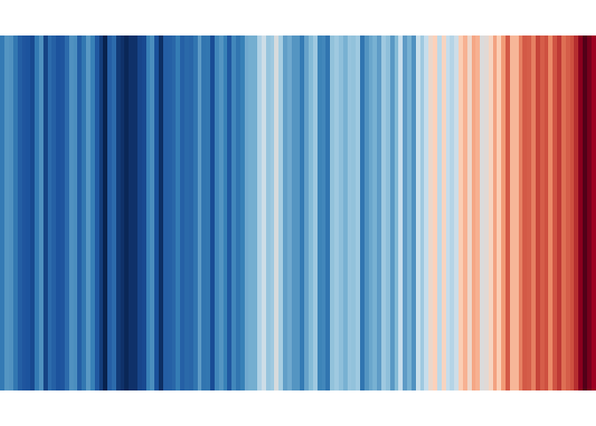

charts
================

A repo of reproducible charts

# Table of Contents

  - [Climate Change Barcodes](#climate-change-barcodes)

## Climate Change Barcodes

“Barcode” plots showing the long term rise in global and US
temperatures. Each vertical stripe represents the temperature of a
single year, ordered from the earliest available data to the present.
Original figures by [Ed
Hawkins](http://www.climate-lab-book.ac.uk/2018/warming-stripes/#more-5516).

Example: Global temperatures from 1880 - 2017, NASA
<!-- -->

# Author and License

  - Author: John Paul Helveston (www.jhelvy.com)
  - Date First Written: Saturday, May 26, 2018
  - License: GPL-3
