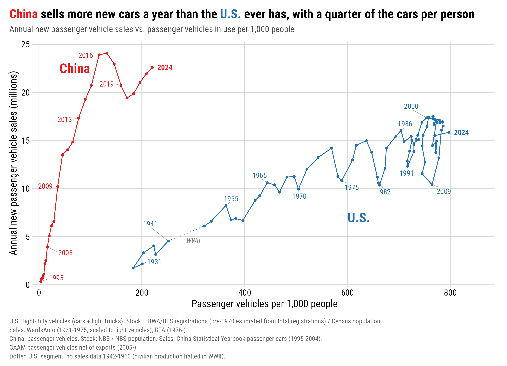

# U.S. vs. China: Passenger Vehicle Sales vs. Passenger Vehicles per 1,000 People

Reproducible data package and R/ggplot2 code for a figure comparing passenger-vehicle fleets and passenger-vehicle sales in the United States and China:

- **x-axis:** passenger vehicles in use per 1,000 people
- **y-axis:** annual new passenger vehicle sales (millions)

This project merges two earlier versions of the figure. The original (2017) version covered U.S. 1931–2015 and China 1995–2015. The 2026 update rebuilt the modern series from official sources. This version uses the modern series wherever they exist and the original historical sales series for earlier years. Coverage is U.S. 1931–2024 and China 1995–2024.

## Quick start

Run the three scripts in order from anywhere in the `charts` repo. Paths use `here::here('vehicleAdoptionUsChina', ...)`.

```r
source(here::here('vehicleAdoptionUsChina', 'formatHistoricalSales.R'))
source(here::here('vehicleAdoptionUsChina', 'formatData.R'))
source(here::here('vehicleAdoptionUsChina', 'makePlots.R'))
```

Required packages: `tidyverse`, `cowplot`, `ggrepel`, `ggtext`, `here`. The figure uses the Roboto Condensed font.

Scripts:
1. `formatHistoricalSales.R`: cleans the historical sales series from the original figure (WardsAuto U.S. 1931–1975; China Statistical Yearbook 1995–2004).
2. `formatData.R`: builds the country-year table and merges in the historical sales.
3. `makePlots.R`: makes the figure.

Outputs:
- `data/clean/us_sales_historical.csv`, `data/clean/china_sales_historical.csv`
- `data/clean/passenger_sales_ownership.csv`
- `plots/salesVsOwnership.png` and `.pdf`



### Options (top of `formatData.R`)

| option | default | meaning |
|---|---|---|
| `CHINA_SALES_BASIS` | `"domestic"` | `"domestic"` uses CAAM passenger sales minus passenger exports. `"incl_exports"` uses CAAM's headline figure. |
| `US_BACKCAST_PRE1970` | `TRUE` | Estimates the U.S. light-duty stock before 1970 (see below). Needed for the 1931–1969 sales years. |

Option at the top of `formatHistoricalSales.R`:

| option | default | meaning |
|---|---|---|
| `US_SCALE_WARDS_TO_BEA` | `TRUE` | Scales pre-1976 Wards totals by the 1976–1980 BEA/Wards ratio (0.974) so they count light vehicles only. |

### Historical sales (from the original figure)

BEA light-vehicle sales start in 1976. CAAM's passenger-vehicle category starts in 2005. The earlier years come from the series used in the original 2017 figure, recovered from `pCloud Drive/data/cars/`:

- **U.S. 1931–1975: `us_sales_wards_1931_2014.csv`.** WardsAuto U.S. vehicle sales (cars + trucks), copied from `data/cars/us/sales/1931-2014_us_vehicle_sales.csv`. The original WardsAuto workbook (`1931-2012_car-truck sales.xls`, same values) carries a "redistribution prohibited" notice, so only this annual-total extract is included here. Wards publishes only odd years for 1931–1961 and no years for 1942–1950, when civilian car production stopped for WWII. The figure draws that gap as a dotted line. Wards totals include medium and heavy trucks. Over 1976–1980, BEA light-vehicle sales are a steady 97.4% of the Wards total, so by default the pre-1976 values are scaled by that ratio.
- **China 1995–2004: `china_sales_yearbook_1995_2014.csv`.** China Statistical Yearbook passenger car sales (millions), copied from `data/cars/china/sales/aggregateSales_1995_2014.csv`. Only 1995–2004 are used. This series is narrower than CAAM's 乘用车 category: for 2005 it reports 3.32M versus CAAM's 3.97M. Expect a small step up at the 2004/2005 splice. Exports before 2005 were negligible.

**Original file locations (John's pCloud Drive):**

| file in `data/raw/` | original on pCloud |
|---|---|
| `us_sales_wards_1931_2014.csv` | `~/pCloud Drive/data/cars/us/sales/1931-2014_us_vehicle_sales.csv` |
| (not copied; WardsAuto workbook with the redistribution notice) | `~/pCloud Drive/data/cars/us/sales/1931-2012_car-truck sales.xls` |
| `china_sales_yearbook_1995_2014.csv` | `~/pCloud Drive/data/cars/china/sales/aggregateSales_1995_2014.csv` |

Source notes for these files are in `~/pCloud Drive/data/cars/us/sources.txt` and `~/pCloud Drive/data/cars/china/sources.txt`. The original 2017 figure's compiled data (read by its old `plots.R`) are in `~/pCloud Drive/data/cars/vehiclesPer1k/` (`us/vehiclesPer1k_latest.csv`, `china/vehiclesPer1k_latest.csv`).

The original figure's U.S. ownership series (cars only before 1945, a linear estimate for 1945–1974, and Polk counts after) is *not* used. All U.S. stock values come from the FHWA/BTS light-duty series described below, so the whole series uses one definition.

## Why "light-duty vehicles" for the U.S.

In U.S. statistics, "passenger car" means sedans, coupes, and wagons only. SUVs, pickups, and minivans are classified as **light trucks**. Light trucks now make up about four of every five new personal vehicles sold. A cars-only U.S. series would therefore exclude most household vehicles and would not be comparable with China's passenger-vehicle category, which includes SUVs and MPVs. This package uses **light-duty vehicles (cars + light trucks)** for both the U.S. fleet and U.S. sales.

This also matches the original figure. BEA light-vehicle sales average 17.35 million in 2000, which is the original figure's U.S. peak. Total vehicle sales including heavy trucks were 17.8 million that year.

For China, the passenger categories used are CAAM 乘用车 (sedans, SUVs, MPVs, crossovers) for sales and NBS 载客汽车 (passenger vehicles) for the stock. The original figure's China values for 2009 (≈10.3M) and 2010 (≈13.8M) match CAAM passenger-vehicle sales.

## Raw data sources (`data/raw/`)

### U.S. light-duty vehicle stock: `us_light_duty_registrations.csv`
Registered light-duty vehicles (cars, SUVs, vans, pickups). Motorcycles, buses, and single-unit/combination trucks are excluded.
- **1970, 1975, 1980, 1985, and 1990–2006:** BTS *National Transportation Statistics* (2011 ed.), Table 1-11, "Passenger car" + "Other 2-axle 4-tire vehicles" (FHWA's old categories). https://www.bts.gov/archive/publications/national_transportation_statistics/2011/table_01_11
- **2007–2014:** BTS NTS Table 1-11, "Light duty vehicle, short wheel base" + "long wheel base" (FHWA's categories from 2007 on). https://www.bts.gov/archive/publications/national_transportation_statistics/table_01_11
- **2015–2024:** FHWA *Highway Statistics* Table VM-1, "All light duty vehicles," from the 2016, 2017, 2019, 2020, 2021, 2023, and 2024 editions. The 2024 edition is at https://www.fhwa.dot.gov/policyinformation/statistics/2024/vm1.cfm. The `source` column records which edition each value came from.

**The 2007 category change:** FHWA moved from the old categories to wheelbase-based ones in 2007. The *split* between the two categories changed sharply, but their *sum* is continuous: 234.5M in 2006 versus 235.7M in 2007. That is why this package uses only the total.

**Missing years:** BTS publishes only five-year values for 1970–1985, so 1971–74, 1976–79, 1981–84, and 1986–89 are missing. For those years, the script linearly interpolates the light-duty *share* of all registered vehicles and multiplies it by FHWA total registrations. These rows are labeled "interpolated" in the clean file's `own_source` column.

**Before 1970:** FHWA does not separate light trucks before 1970. If `US_BACKCAST_PRE1970 = TRUE`, the script holds the 1970 share (93%) constant. This is a rough approximation and is labeled as such in the output. FHWA totals before 1970 are rounded to whole millions, so per-1,000 values for 1931–1969 are approximate. Trucks made up a larger share of registrations in the 1930s, so the backcast likely overstates light-duty ownership in those years by a few percent.

### U.S. total registrations: `us_registrations_fhwa.csv`
FHWA, *Our Nation's Highways 2026*, Table 4-1 (1900–2024, millions, rounded). These totals are used only as the base for the interpolated and backcast years. https://www.fhwa.dot.gov/policyinformation/pubs/our_nations_highways_2026/vehicles.cfm

### U.S. population: `us_population.csv`
Census Bureau resident population as of July 1.
- **1900–2014:** Census historical and intercensal series, as tabulated by multpl.com (rounded to 10,000). https://www.multpl.com/united-states-population/table/by-year
- **2015–2024:** Census Population Estimates Program (Vintage 2020 for 2015–2019; Vintage 2024 for 2020–2024).

### U.S. light-vehicle sales: `us_sales_bea_altsales_monthly.csv`
BEA *Supplemental Estimates, Motor Vehicles*, "Light Weight Vehicle Sales: Autos and Light Trucks," retrieved from FRED (`ALTSALES`) on 2026-10-01. https://fred.stlouisfed.org/series/ALTSALES

The data are monthly, seasonally adjusted annual rates. Each calendar year is the mean of its 12 months, and partial years are dropped. The series counts new vehicles sold in the U.S., including imports. To refresh: `read.csv("https://fred.stlouisfed.org/graph/fredgraph.csv?id=ALTSALES")`.

### China passenger vehicle stock: `china_passenger_vehicle_stock_nbs.csv`
NBS "Possession of Passenger Vehicles" (载客汽车), year-end stock, in 10,000 units.
- **1990–2010:** *China Statistical Yearbook 2011*, Table 16-24. https://www.stats.gov.cn/sj/ndsj/2011/html/P1624e.htm
- **2011:** *China Statistical Yearbook 2012*, Table 16-24.
- **2015–2023:** NBS data portal, via DBnomics series `NBS/A_A0G0I/A0G0I02`. https://db.nomics.world/NBS/A_A0G0I
- **2024:** The same series. The value is inferred as the series maximum in a later DBnomics retrieval, so it should be verified.
- **2012–2014:** Not compiled here. The script interpolates the passenger share of all civil vehicles between 2011 and 2015 (using `china_civil_vehicles_nbs.csv`). These rows are labeled "interpolated."

**Coverage:** The category includes large and medium buses, which were about 1.5% of the total in 2015 and less since. Small passenger vehicles alone (series `A0G0I05`) are an alternative if you want to exclude buses. Pre-2002 detailed categories are not fully comparable with later years (NBS footnote). The total passenger series is used here.

### China population: `china_population_nbs.csv`
NBS year-end total population, in 10,000 persons.
- **2015–2024:** DBnomics `NBS/A_A0301/A030101`.
- **1990–2014:** *China Statistical Yearbook* (the series revised after the 2020 census). These values were not independently re-verified.

### China passenger vehicle sales and exports: `china_passenger_sales_caam.csv`
China Association of Automobile Manufacturers (CAAM), passenger vehicle (乘用车) sales and passenger vehicle exports, 2005–2025.
- **Verified against CAAM releases reported in the press:**
  - Sales: 2012 (15.495M), 2013 (17.929M), 2016 (24.377M), 2024 (27,562,989), and 2025 (30,103,140).
  - Exports: 2013 (596,300), 2016 (477,000), 2024 (4,955,134), and 2025 (6,037,959).
- **Derived from published growth rates:** exports for 2012, 2015, and 2023.
- **Flagged "verify":** all other values are compiled from CAAM annual releases. Exports for 2005–2011 and 2014 are approximate. They are small (under 0.5M), so the uncertainty barely affects the figure.

The quality of each value is recorded in the `pv_sales_quality` and `pv_exports_quality` columns.

**Why the default nets out exports:** CAAM "sales" are factory shipments, which include exports and exclude imports. Passenger exports rose from about 0.7M in 2019 to 6.0M in 2025. Subtracting them gives domestic sales of domestically built vehicles, which is the closer match to BEA's U.S. sales. This domestic figure is still missing imports of about 0.4–0.7M per year.

For cross-checks: CAAM reports 2025 domestic passenger sales of 24.07M, up 6.4% from 2024. The China Passenger Car Association (CPCA) retail series, which includes imports, gives 23.37M (2024) and 23.26M (2025).

## Comparability notes

- **Stock timing:** U.S. population is as of mid-year (July 1). China's stock and population are year-end figures.
- **Stock definitions:** U.S. light-duty counts include commercial and government light vehicles. China's passenger category includes buses (about 1%). Both exclude motorcycles.
- **Registration counting:** FHWA counts every vehicle registered at any point during the year. This slightly overstates the vehicles in use on a given date.

## Cleaned output: `data/clean/passenger_sales_ownership.csv`

| column | description |
|---|---|
| country | "U.S." or "China" |
| year | calendar year |
| vehicles_per_1000 | passenger/light-duty vehicles per 1,000 people |
| sales_millions | annual new passenger/light-duty vehicle sales, millions |
| own_source | stock source and method (published / interpolated / backcast) |
| sales_source | sales source and basis |
